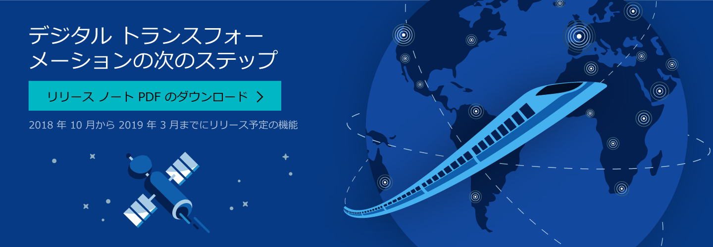

# 2018 年 10 月リリースの概要October '18 release overview

[2018 年 10 月リリース ノート PDF のダウンロード](https://go.microsoft.com/fwlink/p/?linkid=2005971) (最終更新日 2018/9/24)[Download the October '18 Release Notes PDF](https://go.microsoft.com/fwlink/p/?linkid=2005971) (last updated September 24, 2018)

Microsoft のビジネス アプリケーション リリース 2018 年 10 月ウェーブでは、ビジネスを変革するための重要な機能が提供されています。The October ’18 wave of business application releases from Microsoft provides you with significant capabilities to transform your business. これらの新しいサービスや機能は、2018 年 10 月から提供開始となります。These new services and capabilities become available starting in October 2018. (リリース ノートで説明されている機能は、まだリリースされていない場合があります。)(These release notes describe functionality that may not have been released yet. 提供タイムラインおよび予定されている機能は、変更される可能性、または出荷されない可能性があります ([Microsoft ポリシー](https://go.microsoft.com/fwlink/p/?linkid=2007332)を参照)。Delivery timelines and projected functionality may change or may not ship (see [Microsoft policy](https://go.microsoft.com/fwlink/p/?linkid=2007332)).)

- **Dynamics 365 アプリケーションの機能強化**には数百もの新機能が含まれており、その対象範囲としては、Sales、Marketing、Customer Service、Portals、Omni-channel Engagement Hub、Field Service、Project Service、Social Engagement、Finance and Operations、Talent、Retail、および Business Central がカバーされています。**Enhancements to Dynamics 365 applications** include hundreds of new capabilities across Sales, Marketing, Customer Service, Portals, Omni-channel Engagement Hub, Field Service, Project Service, Social Engagement, Finance and Operations, Talent, Retail, and Business Central. 今リリースでは、Microsoft レイアウトと Microsoft リモート アシストを使用して、新しい複合現実エクスペリエンスが導入されています。We're introducing a new set of mixed reality experiences using Microsoft Layout and Microsoft Remote Assist.

- **新しいインテリジェンス アプリケーション**では、Microsoft Research が数十年にわたって開発してきた AI 技術によって、Dynamics 365 のインテリジェンス機能がさらに強化されています。**New intelligence applications** employ decades of AI work pioneered by Microsoft Research to make Dynamics 365 more intelligent. お客様は、新しい Dynamics 365 AI for Sales アプリケーションを使用して、営業のパフォーマンスとプランニングを強化することができます。You can enhance sales performance and planning with the new Dynamics 365 AI for Sales application. 

- **新しい Power Platform** 機能では、Power BI、PowerApps、Microsoft Flow、アプリ用 Common Data Service、および Power BI のデータフローを充実したツール内に統合して、Dynamics 365 と Office 365 を拡張、カスタマイズ、統合することができます。**New Power platform capabilities** combine Power BI, PowerApps, Microsoft Flow, the Common Data Service for Apps, and Power BI dataflows into an unmatched palette of tools to extend, customize, and integrate Dynamics 365 and Office 365 into your environment. 

- **データ統合**は、Power Platform やその他のプラットフォームへの組み込み接続を提供し、数百ものビジネス システムのデータを使用して、充実したインテリジェントなエクスペリエンスを実現します。**Data integration** provides built-in connectivity to the Power platform and more, with data across hundreds of business systems, enabling rich and intelligent experiences. Common Data Model は、Dynamics 365、アプリ用 Common Data Service、および Power BI データフローの間に正規ビジネス エンティティのセマンティック面での一貫性を提供し、アプリケーション開発者、ISV パートナー、インテグレーターにとっての価値を高め、時間を短縮します。The Common Data Model provides semantic consistency for canonical business entities across Dynamics 365, Common Data Service for Apps, and Power BI dataflows, increasing value and saving time for application developers, ISV partners, and integrators.

- **他の Microsoft 製品との統合もより緊密化**され、Dynamics 365 や Microsoft Outlook、Teams、SharePoint、Stream、Azure、および LinkedIn と連携したシームレスなエクスペリエンスが実現しています。**Deeper integrations with other Microsoft products** offer seamless experiences with Dynamics 365 and Microsoft Outlook, Teams, SharePoint, Stream, Azure, and LinkedIn. Dynamics 365 は、Office 365 や Bing から送られたデータや信号との連携性においても機能強化されています。We’ve enhanced Dynamics 365 with data and signal from Office 365 and Bing.

- **パフォーマンス、使いやすさ、およびサポート性に関する機能強化**では、アプリケーションとその基盤のプラットフォームが改善され、ビジネス運営上のエクスペリエンスがさらに向上しています。**Performance, usability, and supportability enhancements** improve the applications and underlying platform, and provide a better experience for you to run your businesses.

これらの機能強化により、お客様、パートナー、およびユーザーは、それぞれの条件下でデジタル変革を効果的に促進することができます。We’ve done this work to help you—our partners, customers, and users—drive the digital transformation of your business on your terms.

Microsoft では、これらの新しいサービスや機能をスムーズに導入していただけるよう積極的に取り組むと共に、2018 年 10 月リリースに関する皆様からのフィードバックをお待ちしています。We’re looking forward to engaging with you as you put these new services and capabilities to work, and we’re eager to hear your feedback as you dig into the October ’18 release.

ぜひご意見をお寄せください。Let us know your thoughts. [Dynamics 365](https://community.dynamics.com) または ["Power" 製品スイート](https://powerusers.microsoft.com/) (Power BI、PowerApps、Flow、Stream) のユーザーのコミュニティ フォーラムで、フィードバックを共有してください。Share your feedback on a community forum for [Dynamics 365](https://community.dynamics.com) or users of the ["Power" suite of products](https://powerusers.microsoft.com/) (Power BI, PowerApps, Flow, and Stream). お客様のフィードバックは改善に役立てられます。We’ll use your feedback to make improvements.

